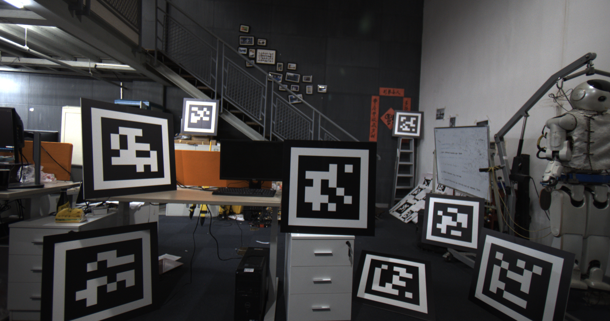
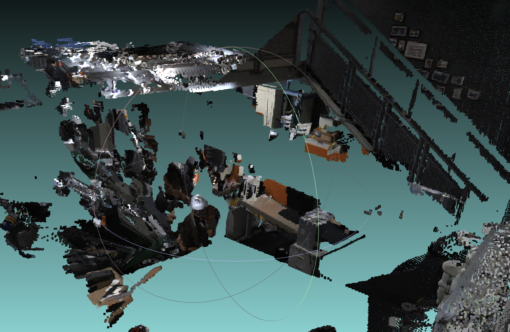

# HDL_daliy_report

# HDL_map

### 数据采集:

- 激光数据采集

  录制rosbag并解析

- 图像数据采集

  使用Python脚本,依次启动相机,并抓取图像

### 标定整体框架:


### 2020-12-24

**当前进展:**

- AprilTag检测与点云生成
- 2D激光点云手动筛选
- 激光点云与AprilTag点云粗对齐与ICP配准
- 点云重投影并着色


**结果:**

- AprilTag检测

  

- ICP结果


- 重投影结果

  

  ​	从重投影的结果中看外参的估计还是存在问题
  
- 点云着色结果

  

**当前存在问题:**

1. 外参存在误差
   - 解决思路:
     - 在场景中增加Apriltag的数量,并合理分布
     - 将激光点云分割后,分别对平面进行拟合,然后通过点到面的误差进行优化
   
2. 遮挡问题

   由于激光和相机的物理位置存在差异,因此实际上激光的点云的遮挡关系和相机的图像中的遮挡关系并非完全一直,如果直接进行点到相机的投影,会存在一定的错误关系.


### 增加Apriltag板

​	如图


目前存在问题:电机的电路板疑似烧坏,无法正常采集激光数据.已经向靖鑫要了一块新的.预计明天换上后可以正常采集激光数据.


### 2020-12-25

#### 1.脚本整理

​	整理AprilTag检测的脚本,并更新至git

mouyihanghttps://github.com/QiukuZ/HDL_map


#### 2.Cam5在光照更充足的环境中重新标定


由于实验室中,一楼场地有限且楼顶的灯坏了几盏,第一次为五个相机标定场景整体偏昏暗.为了获得更好的标定效果,将场景放置与室外重新标定


标定参数对比:

上一次标定参数:

```yaml
fx: 1.754137913229223e+03 
fy: 1.755200775104204e+03 
cx: 2.030387304383353e+03
cy: 1.087842493568630e+03
k1: -0.106728251977730
k2: 0.040799890673344
p1: 0
p2: 0
k3: 0
```

新标定结果:

```yaml
fx: 1.754114780777730e+03
fy: 1.755470859251351e+03
cx: 2.026031762952422e+03
cy: 1.058591039669375e+03
k1: -0.104542307198254
k2: 0.038770788645523
p1: 0
p2: 0
k3: 0
```


#### 3.关于去畸变对AprilTag检测效果的比较

由于标定使用Matlab进行,R

测试图像:


上图为原始图像,下图为去畸变后的图像

分别对图像进行检测,获得恢复后的Apriltag点云


其中红色为去畸变获得的点云,绿色为原始图像获得mouyihang的点云

[准备后续验证一下:对未去畸变的图像检测出来的Apriltag的边缘进行去畸变,获得的点云是否和去畸变获得tag一致]


#### 4.点云的获取

​	获得了新的电机驱动板,重新采集了点云数据


TODO:

1.验证 去畸变点云 和 原始点云 与 激光点云的对齐关系 

2.激光点云重投影时的遮挡问题

3.激光点云重投影时的畸变问题


#### 2020-12-28

**1.**完善点云icp流程 + 完善点云重投影脚本

**2.**对新采集的数据进行测试

​	点云对齐可视化:


​	重投影可视化


​	边缘处依然存在一些对齐的问题.但是中心处的对齐基本一直

​	可能可行的思路:

​	1.由于目前实验室中可用的Apriltag板,比较多的都是韩总之前贴在板子上的,这样无法明确获得Apriltag在激光中的边界.如果能获得Aprital板子在激光中的边界,ICP的约束应该会更加有效

​	2.采用优化的思路,来解决这个问题(但是依然可能不太好勾勒出标定板的边界)

**3**.点云遮挡问题

​	在易现的时候做过一般,但是python做的,速度不佳,考虑改写成cpp


**[TODO]**:

​	1.用已知边界的Apriltag板子进行ICP,增加约束.[目前实验室中有两块,如果有必要可能需要额外购买一些]

​	2.将点云遮挡的代码改成C++


#### 2020-12-29

**1.**遮挡问题的解决

​	最终还是用Python实现.为了解决遮挡问题,使用pcl库的kdtree将点云到相机中心的距离进行排序.简单流程示意图如下:

​	


​	其中uv_block指的是u,v范围 正负block_size(10)的像素框.	

​	进行遮挡处理前的点云:


​	进行遮挡处理后的点云[计算了法向量]:


​	进行遮挡后的重投影效果:



**2.**点云着色

​	进行点云着色后的点云:


**TODO**:

1.与方献泽去新楼打印一批新的标定板

2.尝试点云纹理贴图

3.剩余相机的标定


#### 2020-12-30

**1.AprilTag 生成与打印**

​	使用OpenMV生成10块AprilTag板子,已经联系新楼打印店老板进行打印 [板子尺寸 60cm 60cm 1cm]

​	老板说大概元旦结束时能打印完成.

​	其余相机的标定等标定板完成后再继续进行

**2.完善点云遮挡和着色脚本,并更新至github**

**3.贴图问题**

 	借助开源项目https://github.com/nmoehrle/mvs-texturing

```shell
# Texturing (3D model + images + camera parameters --> textured 3D model)
$codedir/texrecon/build/apps/texrecon/texrecon scene::undistorted surface-clean.ply textured
```

数据格式需要进一步处理,已经在本地编译完成

**4.读长哥初版论文**


### 核动力项目工作清单

1.旋转激光见图模块


​	目前标定板已经到,可以进行剩下部分的标定

| 时间节点 | 工作安排                                      |
| -------- | --------------------------------------------- |
| 1-10     | 完成所有相机与激光的标定,获得彩色三维360°点云 |
| 1-14     | 纹理贴图和Mesh生成                            |
| 1-14之后 | 复习期末考试和作业论文                        |


关于导航和定位模块,等核动力的小车底盘到位之后,再去迦智找人帮忙安装和测试相关的功能.

等小车到位以后,硬件系统在小车的排线\安装等也需进一步考虑


#### 2021-1-4

1.与长哥初步讨论论文中存在的一些语法问题

​	已经沟通

2.新标定板到了,替换用新的标定板获得结果


单个激光的目前效果:


先不考虑具体的激光点云的标定问题和相机激光的标定问题,先获得一个测试结果.用以给核电那边的人做一个demo


3.整体流程整理

​	1.激光数据采集 roslaunch urg_node urg_lidar.launch

​	2.图像数据采集 crab_image.py

​	3.激光to总体点云 [这里有一个外参待优化] bash run_get_pointcloud.bash 

​	4.图像Apriltag检测并生成点云 bash run_apriltag_detect.bash

​	5.点云遮挡计算并着色 bash run_ply_occlude_coloring.bash


4.剩余相机的标定

​	cam5:


​	cam1:[存在问题]


​	存在一定问题,需要进一步检查[内参?畸变矫正???]

​	很有可能是内参标定在室内的参数不佳导致,明天在室外开阔的场景进行棋盘格的重新采集


#### 2021-01-05

1.关于AprilTag用来标定的精度问题:

​	今天将五个相机都放到实验室外开阔的场景进行了重新的标定,发现,不同的标定结果对AprilTag的检测结果有较大影响,证明了用Apriltag进行位姿和标定板的位姿存在一定的误差.具体可由上图中CAM1中的结果和下图表明:


​	**考虑到尽快给出一个初始的效果,先用AprilTag的结果做一个demo,然后考虑用COLMAP进行SFM,标定五个相机间的POSE以及将单帧激光扫描结果和SFM获得的点云进行一个ICP配准**


**CAM1:**


​	可以发现中心和近处的点云没有问题,但是边缘处和周围的点还是有较大问题,其余的CAM类似


​	粗略的完成五个相机的标定:

结果点云[其中Cam1的标定貌似有一些问题,也有可能是由于物体太近导致了问题的放大]

**视角1**


**视角2**


**视角3:该视角表明cam1有点问题**




**总体俯视图:**


**[TODO整体流程回顾]:**

**[后续思路&TODO]**

2.使用COLMAP建图进行点云配准的外参标定

3.激光的外参需要加新一步优化


​	在经过180度的旋转之后激光存在小范围的偏差


#### 2021-01-06

1.居住舱激光SLAM

2.韩总Paper符号修改

3.激光数据验证,发现的确存在一定的待优化的外参


可以看到在地面,重复扫描时,出现了分层现象,分层的距离大约为4cm左右.