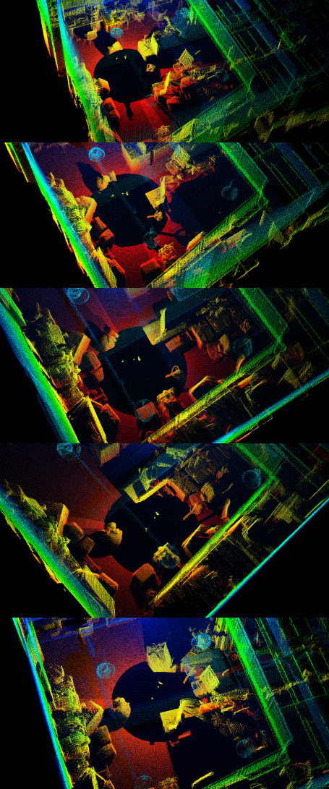

## HDL_DAILY_REPORT

#### 目前情况:

- 激光电机外参标定完成
- 相机之间外外参/激光相机Base外参的标定按下图进行


- 实验室人员多,计划0113早晨进行数据采集


#### 2021-01-13

- 数据采集[Done!]



​	600+张运动相机的图像+ 5*5张相机系统图像 + 5个地点的激光扫描[如上图]

- 图像COLMAP运行[使用COLMAP估计的内参进行建图]

  所选用的相机模型 [fx,fy,cx,cy,k1,k2]

  一共注册了632张image + 152998 个特征点

  


- 下一步: 使用AprilSLAM恢复相机的pose以及Tag的世界坐标[这一步可能需要采集的图像序列中对AprilTag的观测不间断]


#### 2021-01-14

- 实际测试表明AprilSlam对apriltag的检测效果不佳,而且由于是SLAM,不允许间断,这样对整个拍摄要求还是有点高的
- 由于COLMAP是对无序的图像进行重建,本着这个思路,对AprilTag的重建也是对无序图像进行重建
  - Step1.遍历所有的图像进行AprilTag的检测
  - Step2.根据AprilTag进行图像的匹配
  - Step3.根据Apriltag提供的位姿进行粗略的地图构建
  - Step4.全局做一个优化
  
  

**apriltag_detect_slam.python[Done]**

- 对所有输入的图像进行Apriltag检测
- 输入: 图像文件 + 相机参数文件[内参+畸变]
- 输出结果到txt:  image_path + tag_id  + tag_pose

```
/home/qk/Desktop/2Dlaser/calib_co_april/move_cam/raw/09_31_31_992.png
tag_num 3
tag_id 14
-0.0038321618801131496 0.9894535194577134 0.14480002544222412 0.4803617395013612 
-0.9565231873997324 -0.045855759129169504 0.28802888973390084 0.06830523619435858 
0.29163111374128214 -0.13740080853994896 0.9466109609076939 1.4199594244632063 
0.0 0.0 0.0 1.0 
tag_id 15
-0.3516640464714722 0.09458340286451579 0.9313358031998334 2.6271618006169435 
-0.26943803226102836 -0.9630096804000527 -0.003937286768015219 -0.7603740918266348 
0.8965129922040257 -0.2523218883853663 0.3641402469530489 3.0052332688109358 
0.0 0.0 0.0 1.0 
tag_id 20
0.25414559394286396 -0.8537185426340415 -0.45450485920640854 -0.7139860305536779 
0.8318326773859872 -0.04680360339189149 0.553049563368777 0.3006400820030495 
-0.4934211324135694 -0.5186271036808073 0.6982560514706392 2.2288445810225315 
0.0 0.0 0.0 1.0 
```

文件格式如上图所示


#### 2021-01-15

- 基于AprilTag的地图粗略恢复

  

  

- 相同图像Colmap建图

  

  

- Apriltag约束的优化,还需要进一步测试

