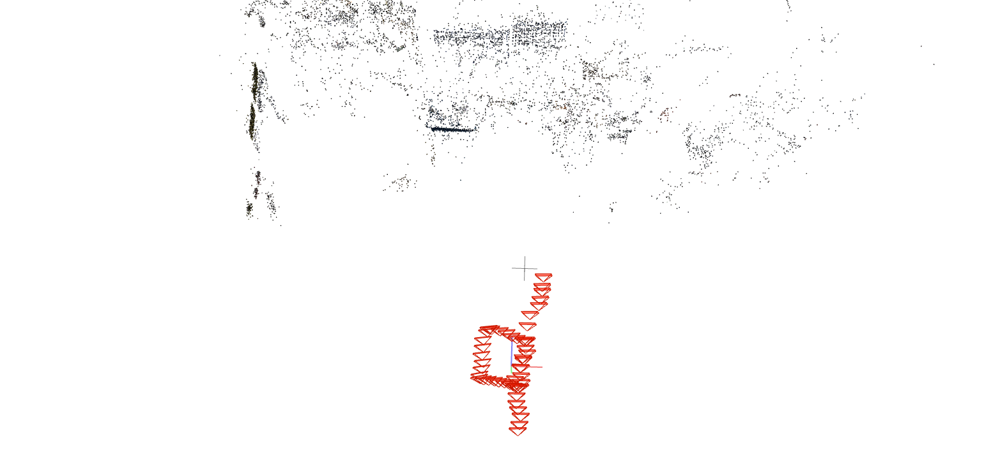
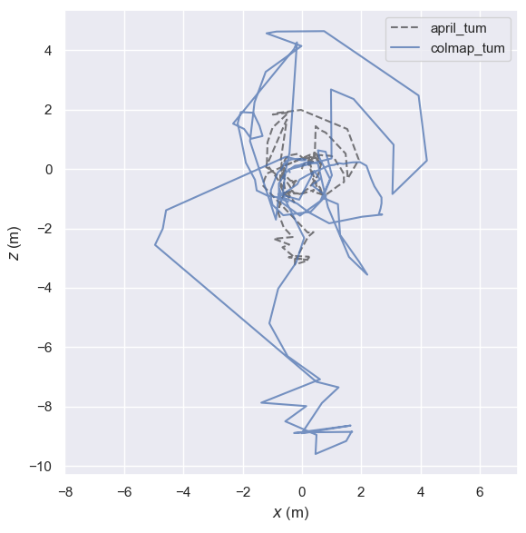
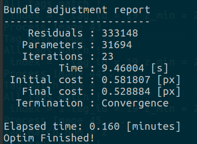
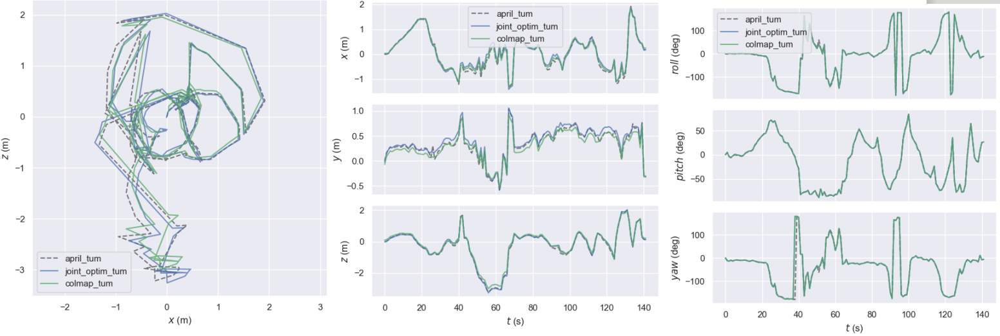

## HDL_DAILY_REPORT

#### 目前情况:

- 激光电机外参标定完成
- 相机之间外外参/激光相机Base外参的标定按下图进行


- 实验室人员多,计划0113早晨进行数据采集


### Colmap 和 Eigen中的注意点

1. Colmap中的Image位姿表示为 world in image[有必要时需要进行转置]

2. Eigen中的 q.coeffs() 输出顺序 q.coeffs = q.x q.y q.z q.w

3. 从四元数恢复旋转矩阵的方法

   

#### 2021-01-13

- 数据采集[Done!]


​	600+张运动相机的图像+ 5*5张相机系统图像 + 5个地点的激光扫描[如上图]

- 图像COLMAP运行[使用COLMAP估计的内参进行建图]

  所选用的相机模型 [fx,fy,cx,cy,k1,k2]

  一共注册了632张image + 152998 个特征点

  


- 下一步: 使用AprilSLAM恢复相机的pose以及Tag的世界坐标[这一步可能需要采集的图像序列中对AprilTag的观测不间断]


#### 2021-01-14

- 实际测试表明AprilSlam对apriltag的检测效果不佳,而且由于是SLAM,不允许间断,这样对整个拍摄要求还是有点高的
- 由于COLMAP是对无序的图像进行重建,本着这个思路,对AprilTag的重建也是对无序图像进行重建
  - Step1.遍历所有的图像进行AprilTag的检测
  - Step2.根据AprilTag进行图像的匹配
  - Step3.根据Apriltag提供的位姿进行粗略的地图构建
  - Step4.全局做一个优化
  
  

**apriltag_detect_slam.python[Done]**

- 对所有输入的图像进行Apriltag检测
- 输入: 图像文件 + 相机参数文件[内参+畸变]
- 输出结果到txt:  image_path + tag_id  + tag_pose

```
/home/qk/Desktop/2Dlaser/calib_co_april/move_cam/raw/09_31_31_992.png
tag_num 3
tag_id 14
-0.0038321618801131496 0.9894535194577134 0.14480002544222412 0.4803617395013612 
-0.9565231873997324 -0.045855759129169504 0.28802888973390084 0.06830523619435858 
0.29163111374128214 -0.13740080853994896 0.9466109609076939 1.4199594244632063 
0.0 0.0 0.0 1.0 
tag_id 15
-0.3516640464714722 0.09458340286451579 0.9313358031998334 2.6271618006169435 
-0.26943803226102836 -0.9630096804000527 -0.003937286768015219 -0.7603740918266348 
0.8965129922040257 -0.2523218883853663 0.3641402469530489 3.0052332688109358 
0.0 0.0 0.0 1.0 
tag_id 20
0.25414559394286396 -0.8537185426340415 -0.45450485920640854 -0.7139860305536779 
0.8318326773859872 -0.04680360339189149 0.553049563368777 0.3006400820030495 
-0.4934211324135694 -0.5186271036808073 0.6982560514706392 2.2288445810225315 
0.0 0.0 0.0 1.0 
```

文件格式如上图所示


#### 2021-01-15

- 基于AprilTag的地图粗略恢复

  

  

- 相同图像Colmap建图

  

  

#### 2021-01-16

- Apriltag约束的优化,还需要进一步测试

  

  这是优化后的结果(.....看起来有问题 )

- 0115的apriltag建图有问题的原因:colmap中存储的地图pose都是world to image,而之前存储的格式为image to world,修复后地图的显示正常

- colamp


- apriltag


#### 2021-01-17

- 重新采集了简单运动的数据进行测试

1.采集的图像

COLMAP Result:




apriltag轨迹恢复的结果


[优化还存在一点问题]

[TODO修复apriltag的优化问题 - > DONE]


- Apriltag优化构建完成


[2021-01-18 TODO 重新采集数据进行实验]


#### 2021-01-18

- 代码整理
  - apriltag_detect_slam.py [从raw image中提取每帧image-pose & corners]
  - apriltag_pose_estimate.cpp [从上一步中的txt输出,恢复pose并进行优化]

- tag优化结果

  

  绿色为原始位姿,红色为优化后的tag位姿

- 将tag的原始结果和优化结果放到激光点云地图中进行验证

  - 原始结果

    

  - 优化结果

    

    [**优化后的tag Pose反而变差了????**]

- 优化前后图像位姿的变化

  

  从图像的轨迹看来,好像也是optim之后的效果反倒是不如之前的了??????

- 解决方法  :  鲁棒核函数

  

- [TODO]特征约束和AprilTag约束联合优化

  修改COLMAP code 加入AprilTag约束

  https://github.com/QiukuZ/Colmap-AprilTag


#### 2021-01-19

- AprilTag轨迹生成geos.txt,使用colmap自带提供的model aligner进行对齐

  


- 联合优化

  - 在colmap的优化框架中加入apriltag的约束项

  - apriltag约束构建时:

    - image位姿即colmap中image的位姿

    - image观测从apriltag txt中获得

      [目前存在问题,这个轨迹对齐的误差有点大......应该是存在一些错误的地方(包括)]

- 使用了另一组更为简单的运动做测试发现对齐误差小很多

  

  [**数据采集的时候对标定板的观测还是要控制距离,由于定焦头的缘故, 远处的像素分辨率可能有所影响??????**]

- 用evo_traj查看轨迹

  

[**?????y轴相差很大!?**]

- 另一组比较复杂的简图结果对比

  - 未进行align的地图

  kaoshi

  - 不同参数配置的align结果

    

  

- 关于Align的一些想法:
  - Align的质量其实决定了error的初值,如果align的质量不好,对apriltag的角点观测可能会有比较大的影响
  - 当第二组实验中,apriltag观测较远的时候,观测差异较大,下一次建图用的数据如果想保证较好的观测效果,可能要尽量使tag的距离保持始终


#### 2021-01-20

- 复习考试


#### 2021-01-21

- 复习考试
- [TODO] 重新采集一组数据,保证标定板的距离


#### 流程整理

- 输入:带有AprilTag的Image序列

1. [apriltag_detect_slam.py] => raw.txt[标定板检测信息]
2. [运行colmap进行稀疏重建] => sparse_raw[稀疏重建模型]

#### 2021-01-22

- 以simpletest数据作为测试数据,先把apriltag和BA的优化调通

- 目前存在的问题主要是在轨迹的对齐上,colmap提供了对所有图像和世界点进行相似变换操作的接口[**Transform**],也提供了Align的接口[**Align**]

  - 联合优化的前提是april和colmap的坐标系有一致性

- 初始轨迹

  

Align结果 [colmap的align在rotation上存在很多错误!]


- 最终测试 = colmap的位姿Align + 用第一帧的pose进行Align


#### 2021-01-24~2021-01-27

- 四门考试


#### 2021-01-28

- Align脚本的整理

  - 由于单纯的evo align 和 colmap的align效果都不佳,最终整合了colmap和evo的align,最终获得一个较好的效果 

  - align中的注意点：1.最终由于优化时，image的第一帧将被固定fix，因此在align完成后额外增加一步第一帧的align

    

- Apriltag与colmap的框架整合

  - 大体框架完成
  - 存在一个小问题:[Add Apriltag problem to Sum_Problem的时候发现参数传递存在问题....需要下一步解决]
  - 

  

#### 2021-01-29

- 原始的colmap的BA报告

  

- 加入Apriltag之后的BA报告

  ​	

  新增参差项  784 = 49  * 2 * 4 * 2 [ 49张图片每张图片观测2个tag,每个tag有4个角点加入到BA中,每个角点重投影残差为uv 2 项]

  新增变量数 21 = 7 * 3[tag板子4变量q和3变量t] ?? 可是为什么是3呢?????

- 优化后的质量评估 [再思考一下]

  

  #### 2021-01-30

  更复杂数据的测试[0118-big-test 142张图 很多块板子]

  - BA

    ```
    Bundle adjustment report
    ------------------------
        Residuals : 709332
       Parameters : 140297
       Iterations : 19
             Time : 12.9248 [s]
     Initial cost : 0.6203 [px]
       Final cost : 0.620275 [px]
      Termination : Convergence
    ```

    

  - AprilTag + BA

    ```
    Bundle adjustment report
    ------------------------
        Residuals : 711588
       Parameters : 140374
       Iterations : 77
             Time : 26.1174 [s]
     Initial cost : 4.68002 [px]
       Final cost : 3.66474 [px]
    ```

  - 轨迹对比

    

  - 虽然加了AprilTag后,平均cost到了3.66,但是从轨迹来看依然约束住了,这个误差的增大应该是由于这组数据有很多apriltag的观测距离很远,导致误差很大的缘故.需要重新进行数据的采集

- 